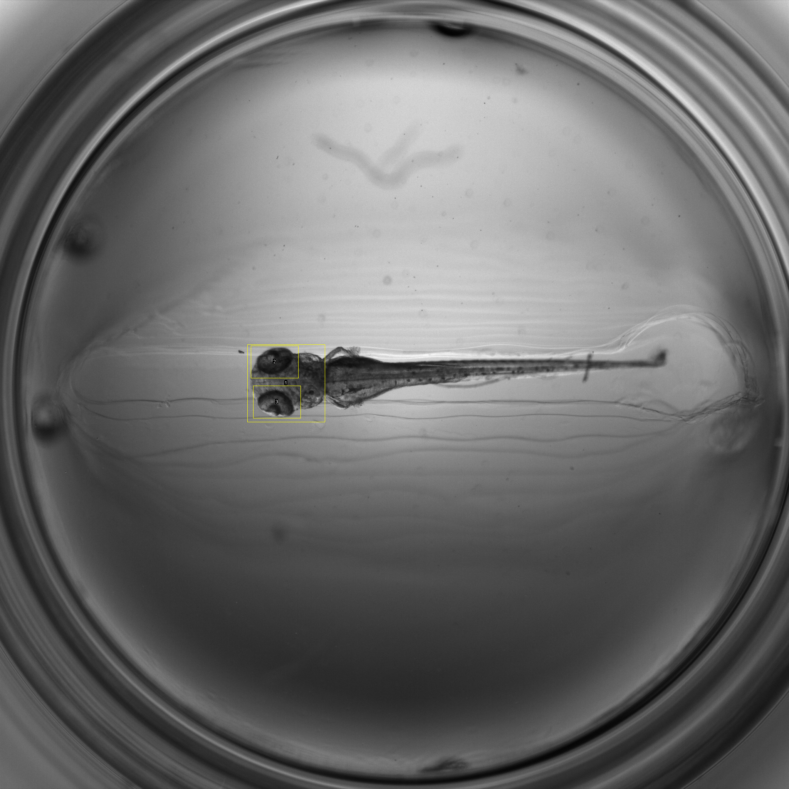

This tutorial was generated with the ImageJ-Macro-Markdown extension provided by Robert Haase
See https://github.com/haesleinhuepf/imagejmacromarkdown

This macro allows to do a 2-step template matching, the 2 templates and the image should be opend in Fiji already.  
The first template allows to find an object and the second template finds a sub-object within the previously found object.   
Therefore the second template must be smaller than the first one.   
Both detection (1st and 2nd template) are returned in the ROI manager.   
 
NB : Make sure the ROI Manager is empty before running this macro 

# Get image names  
```java
selectImage(temp1); 
Temp1_title = getTitle(); 
//print(Temp1_title); 
 
selectImage(temp2); 
Temp2_title = getTitle(); 
//print(Temp2_title); 
 
selectImage(image); 
Image_title = getTitle(); 
//print(Image_title); 
 
```
# Call 1st template matching 
```java
run("Template Matching Image", "template=" + Temp1_title + " image=" + Image_title + " rotate=[] matching_method=[Normalised 0-mean cross-correlation] number_of_objects=1 score_threshold=0.50 maximal_overlap=0.25 add_roi"); 


```
# Loop over stack of ROI 
```java
setBatchMode(true); // do not open extracted slices 
selectImage(image); 
Roi.remove; 
n = nSlices; 
nRoi_old = roiManager("count"); // Roi of the 1st template matching 
for (i=1; i<=n; i++) { 
 	 
	// Isolate slice from stack (to perform the second template matching with a custom search ROI for that slice) 
	selectImage(image); //important here to select back the image when entering a new iteration, during looping the slice is selected 
	setSlice(i); 
	Roi.remove; 
	run("Duplicate...", "title=Slice_"+i); // The isolated slice has for title "Slice_i" 
	 
	// Set search ROI on isolated slice 
	roiManager("select", i-1); // i-1 since ROI manager starts at 0 
	Roi.getBounds(x, y, width, height); 
	makeRectangle(x, y, width, height); 
	//print(x,y,width,height); 
 
	// Run template matching on slice with search ROI 
	run("Template Matching Image", "template=" + Temp2_title + " image=Slice_" + i +" flip_template_vertically rotate=[] matching_method=[Normalised 0-mean cross-correlation] number_of_objects=2 score_threshold=0.50 maximal_overlap=0.25 add_roi show_result"); 
	 
	// Close hidden Slice image 
	//selectImage("Slice_"+i); 
	//close(); 
	 
	// Rename and Set Z-position of the last found ROI 
	nRoi_new = roiManager("count"); 
	 
	for (j=1; j<=nRoi_new-nRoi_old; j++) { 
 
		roiManager("select", nRoi_new-j); 
		run("Properties... ", "position="+i); // Set slice position 
		InitName = call("ij.plugin.frame.RoiManager.getName", nRoi_new-j); 
		roiManager("rename", i + substring(InitName, 1)); 
	} 
	 
	// Update the count 
	nRoi_old = nRoi_new; 
 
} 
 
```

<table>
<tr><th>Image</th><th>Slice</th><th>Template</th><th>Score</th><th>Roi Index</th><th>Xcorner</th><th>Ycorner</th><th>Xcenter</th><th>Ycenter</th></tr>
<tr><td>Slice_1</td><td>1</td><td>temp2</td><td>1.000</td><td>2</td><td>651</td><td>897</td><td>712</td><td>939</td></tr>
<tr><td>Slice_1</td><td>1</td><td>temp2_Vertical_Flip</td><td>0.794</td><td>3</td><td>657</td><td>1001</td><td>718</td><td>1043</td></tr>
</table>

# Again make sure that all ROI are displayed and associated to the slices  
```java
roiManager("Show All"); 
roiManager("Associate", "true"); 
```
